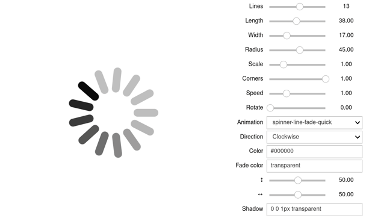

# ipyspin

A Jupyter widget library for dynamically creating spinning activity indicators (based on [spin.js](https://spin.js.org)).

## Try it online!

You can try it online by clicking on this badge:

[](https://mybinder.org/v2/gh/davidbrochart/ipyspin/master?filepath=examples%2Fintroduction.ipynb)

## API

```python
import ipyspin

s = ipyspin.Spinner()

s.layout.height = '500px'
s.layout.width = '500px'

s.lines = 13  # The number of lines to draw
s.length = 38  # The length of each line
s.width = 17  # The line thickness
s.radius = 45  # The radius of the inner circle
s.scale = 1  # Scales overall size of the spinner
s.corners = 1  # Corner roundness (0..1)
s.speed = 1  # Rounds per second
s.rotate = 0  # The rotation offset
s.animation = 'spinner-line-fade-quick'  # The CSS animation name for the lines
s.direction = 1  # 1: clockwise, -1: counterclockwise
s.color = '#000000'  # CSS color or array of colors
s.fade_color = 'transparent'  # CSS color or array of colors
s.top = '50%'  # Top position relative to parent
s.left = '50%'  # Left position relative to parent
s.shadow = '0 0 1px transparent'  # Box-shadow for the lines
s.z_index = 2000000000  # The z-index (defaults to 2e9)
s.class_name = 'spinner'  # The CSS class to assign to the spinner
s.position = 'absolute'  # Element positioning

s.stop()  # Removes the UI elements from the DOM and stops the animation

s.spin()  # Stopped spinners may be reused by calling spin() again

s  # Displays the spinner
```

## Installation

You can install using `pip`:

```bash
pip install ipyspin
```

Or using `conda`:

```bash
conda install -c conda-forge ipyspin
```

And if you use jupyterlab <= 2:

```bash
conda install -c conda-forge nodejs
jupyter labextension install @jupyter-widgets/jupyterlab-manager ipyspin
```

If you are using Jupyter Notebook 5.2 or earlier, you may also need to enable
the nbextension:
```bash
jupyter nbextension enable --py [--sys-prefix|--user|--system] ipyspin
```

## Development Installation

```bash
# First install the python package. This will also build the JS packages.
pip install -e .
```

When developing your extensions, you need to manually enable your extensions with the
notebook / lab frontend. For lab, this is done by the command:

```
jupyter labextension install @jupyter-widgets/jupyterlab-manager --no-build
jupyter labextension install .
```

For classic notebook, you can run:

```
jupyter nbextension install --sys-prefix --symlink --overwrite --py ipyspin
jupyter nbextension enable --sys-prefix --py ipyspin
```

Note that the `--symlink` flag doesn't work on Windows, so you will here have to run
the `install` command every time that you rebuild your extension. For certain installations
you might also need another flag instead of `--sys-prefix`, but we won't cover the meaning
of those flags here.

### How to see your changes
#### Typescript:
To continuously monitor the project for changes and automatically trigger a rebuild, start Jupyter in watch mode:
```bash
jupyter lab --watch
```
And in a separate session, begin watching the source directory for changes:
```bash
npm run watch
```

After a change wait for the build to finish and then refresh your browser and the changes should take effect.

#### Python:
If you make a change to the python code then you will need to restart the notebook kernel to have it take effect.

## Example


